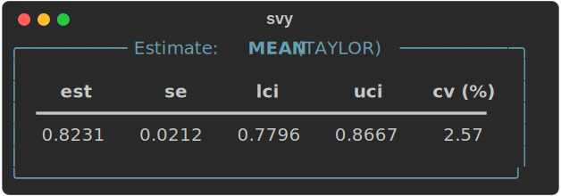
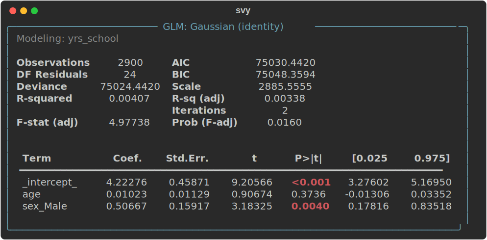

# svy

**Design, analyze, and report complex surveys in Python.**

[](https://pypi.org/project/svy/)
[](https://pypi.org/project/svy/)
[](https://pypi.org/project/svy/)
[](LICENSE)
[](https://svylab.com/docs/svy)

svy is a design-based, production-oriented library covering the full survey workflow: sample size, selection, weighting, estimation, testing, and modeling. It is [validated against R's `survey` package](https://svylab.com/learn/notes/posts/svy-vs-r-comparison/) to six significant digits and powered by a Rust engine.

🌐 [svylab.com](https://svylab.com) · 📘 [Documentation](https://svylab.com/docs/svy) · 🚀 [Quick Tour](https://svylab.com/docs/svy/tutorials/sample_quicktour.html)

---

## Why svy?

- **One object, whole workflow.** A `Sample` binds your data to its sampling design once; `.wrangling`, `.weighting`, `.estimation`, `.categorical`, and `.glm` all hang off it, and the design metadata travels through every step.
- **Correct by construction.** `Sample` is immutable: every transformation returns a new object, and subpopulation analysis (`where=`) keeps the full design for variance estimation instead of filtering rows, which understates standard errors.
- **Replicate weights done right.** Nonresponse adjustment, calibration, raking, and trimming are applied to the replicate weights in the same pass as the full-sample weights, so replication standard errors reflect the whole weighting process.
- **Fast.** Variance estimation and other hot paths run in Rust ([svy-rs](https://pypi.org/project/svy-rs/)); data operations run on Polars. A full pipeline with 500 bootstrap replicates completes in under a quarter of a second on a laptop.
- **Reproducible and automation-ready.** Explicit seeds, typed result objects (`Estimate`, `Table`, `TTest`, GLM fits), and a versioned serialization module make pipelines easy to rerun, audit, and wire into production systems.

## Installation

```bash
pip install svy             # or: uv add svy
pip install "svy[report]"   # adds rich terminal and HTML reporting
```

## The whole workflow as one chain

Every transformation returns a new `Sample`, so an entire workflow reads as one fluent pipeline. Load a bundled survey (runs offline), create an indicator, adjust the weights for nonresponse, trim extreme weights, and estimate the population literacy rate with a design-based standard error:

```python
import svy
import numpy as np

rng = np.random.default_rng(42)

# A bundled example survey; its metadata carries the sampling design
data = svy.datasets.load("ind_sample_wb_2023", source="bundled")
info = svy.datasets.describe("ind_sample_wb_2023", source="bundled")
sample = svy.Sample(data, svy.Design(**info.design))

literacy_rate = (
    sample
    # 1. Wrangle: a 1/0 literacy indicator, plus a simulated response status
    .wrangling.mutate({
        "literate": svy.when(svy.col("literacy") == "Yes").then(1)
                       .when(svy.col("literacy") == "No").then(0)
                       .otherwise(None),
        # simulated for illustration; the example data has 100% response
        "resp_status": rng.choice(
            ["respondent", "non-respondent"], p=[0.85, 0.15],
            size=sample.n_records,
        ),
    })
    # 2. Adjust the weights for nonresponse, within urban/rural classes
    .weighting.adjust(
        resp_status="resp_status",
        by="urbrur",
        resp_mapping={"rr": "respondent", "nr": "non-respondent"},
        wgt_name="nr_wgt",
    )
    # 3. Trim extreme weights to reduce variance
    .weighting.trim(upper=3.0)
    # 4. Estimate the population literacy rate, with a design-based SE
    .estimation.mean("literate", drop_nulls=True)
)

print(literacy_rate)
```



## More analysis

The same `Sample` reaches every other kind of analysis through an accessor.

**Domain estimation** with correct within-domain standard errors:

```python
print(sample.estimation.mean("age", by="urbrur"))
```

```
╭──────────────── Estimate: MEAN (TAYLOR) ─────────────────╮
│                                                          │
│  urbrur       est       se       lci       uci   cv (%)  │
│  ━━━━━━━━━━━━━━━━━━━━━━━━━━━━━━━━━━━━━━━━━━━━━━━━━━━━━━  │
│  Rural    27.4893   3.1681   20.9771   34.0015    11.53  │
│  Urban    29.7557   2.5016   24.6135   34.8978     8.41  │
│                                                          │
╰──────────────────────────────────────────────────────────╯
```

**Tabulation** with design-based standard errors (two-way tables add Rao-Scott tests automatically):

```python
print(sample.categorical.tabulate("educ_attain", units="percent"))
```

**Regression** with design-adjusted standard errors (Gaussian, binomial, Poisson, and Gamma families):

```python
model = sample.glm.fit(y="yrs_school", x=["age", svy.Cat("sex")], family="gaussian")
print(model)
```



The [Quick Tour](https://svylab.com/docs/svy/tutorials/sample_quicktour.html) runs this whole workflow in five minutes, every block offline on the bundled data.

## Capabilities across the survey lifecycle

| Stage | What svy provides |
| --- | --- |
| **Plan** | Sample size for estimation and comparison objectives, with design effects and nonresponse |
| **Select** | SRS, systematic, PPS methods; multi-stage designs with automatic probability chaining |
| **Weight** | Nonresponse adjustment, poststratification, GREG calibration, raking, trimming, normalization |
| **Estimate** | Means, totals, proportions, ratios, medians; Taylor linearization and replication (BRR, Fay, jackknife, bootstrap, SDR) |
| **Test** | Tabulations, t-tests, rank tests, Rao-Scott chi-squared tests, all design-adjusted |
| **Model** | GLMs (linear, logistic, Poisson, Gamma) with design-adjusted standard errors |

All methods are grounded in established survey methodology, with domain estimation (`by=`) and subpopulation analysis (`where=`) throughout.

## Validation

svy is validated against R's `survey` package across design specification, Taylor linearization, replication methods, calibration, categorical analysis, and GLMs, producing numerically identical results to at least six significant digits. The few intentional differences follow Stata conventions and are documented. See the [full comparison with reproducible code](https://svylab.com/learn/notes/posts/svy-vs-r-comparison/).

## Ecosystem

| Package | Purpose | Install |
| --- | --- | --- |
| **svy** | Core survey design & estimation | `pip install svy` |
| [svy-sae](https://svylab.com/docs/svy-sae/) | Small Area Estimation | `pip install svy-sae` |
| [svy-io](https://svylab.com/docs/svy-io/) | SPSS / Stata / SAS I/O | `pip install svy-io` |
| [svy-rs](https://pypi.org/project/svy-rs/) | Rust computational engine used by svy | installed automatically |

This repository is a monorepo: the Python package lives in [`packages/svy`](packages/svy), the Rust engine in [`packages/svy-rs`](packages/svy-rs), and the I/O library in [`packages/svy-io`](packages/svy-io).

## Documentation

Guides, tutorials, and methodological notes: [svylab.com/docs/svy](https://svylab.com/docs/svy). Start with the [Quick Tour](https://svylab.com/docs/svy/tutorials/sample_quicktour.html).

## Citation

A software paper for svy is under review at the Journal of Open Source Software. Until it is published, please cite this repository. The predecessor package, samplics, is described in [Diallo (2021), JOSS 6(68):3376](https://doi.org/10.21105/joss.03376).

## Feedback

- Issues: [github.com/samplics-org/svy/issues](https://github.com/samplics-org/svy/issues)
- Discussions: [github.com/samplics-org/svy/discussions](https://github.com/samplics-org/svy/discussions)

If you work with complex surveys and want to influence the design of a modern Python survey stack, this is the right place to engage.

## License

MIT License. Copyright © 2026 Samplics LLC.

---

**svy is built for practitioners who need statistical rigor that survives contact with reality.**
